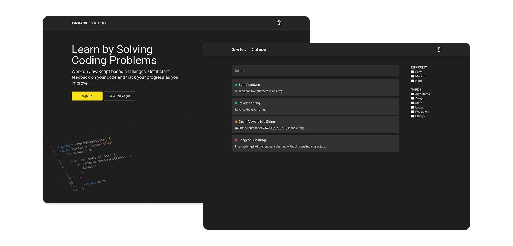

# Solve Script
### Video Demo: https://youtu.be/dG1vZDgqy1M
This is my CS50 final project - a JavaScript coding challenge app that allows users to tackle coding challenges of varying difficulty, get instant feedback on their solutions, track progress, and earn achievements




## Introduction

A coding challenge app idea popped into my head while I was solving challenges on Codewars and LeetCode. Later, I took the CS50x course, and had a really great time throughout all the lectures. Every time I submitted a new problem set I had to use the check50 command, which ran tests on my code, and I was really intrigued by how it worked. Towards the end of the course, I knew what my final project would be, and I'd even started drawing the UI a while back. My work is finished now, and I'm really proud of it.


## Core Features

### Authentication System
-   **User Registration**: Easy sign-up with checks to make sure everything's entered right on both ends
-   **User Login**: Authentication system keeps you logged in safely with secure cookies
-   **Session Management**: Keeps you logged in as you move around the site, no need to keep re-entering your details

### Challenge System
-   **Challenge Browser**: Find the right challenge for you, filter by how hard it is or what it's about
-   **Code Editor**:  a proper code editor, like the one from VS Code
-   **Test Runner**: Hit "run" and see if your code passes all tests
-   **Instant Feedback**: You'll know right away if your code worked or not, with results in the panel
-   **Solution Submission**: Once you've passed all the tests, you can submit your solution

### Progress Tracking
-   **User Profile**: See all the challenges you've completed and any badges you've earned
-   **XP System**: Get points for every challenge you finish
-   **Achievements**: Unlock special badges when you hit certain milestones

## Tech Stack
The front-end is built with React NextJS for server-side rendering and API routes. To keep the codebase clean and catch errors early, I chose TypeScript, adding static typing to JavaScript. Styling is handled with Tailwind CSS that lets me quickly create custom and responsive designs using classes

### Authentication Approach
 I chose Iron Session over JWT or NextAuth because of its simplicity and security. The cookies are encrypted, so a separate token system isn't needed. I really like this library because it doesn't add unnecessary complexity and making authentication with it was enjoyable. Zod is used to ensure the data I receive, especially user input, is valid and maintains its integrity. For securely storing passwords I used bcryptjs


### Editor Implementation
I was looking for a code editor library and stumbled upon Monaco Editor. I didn't realize the same editor VS Code uses was available, which was a pleasant surprise. Since I love VS Code, I had to go with Monaco

### Database Choice
For the database, I chose SQLite. I know it might not sound as fancy as MongoDB or PostgreSQL, but for this project, it's perfect. It's simple, portable, and fast


## App architecture

### Front-end

#### App:
* `page.tsx`: Main page, changes depending on if you're logged in
* `challenges/page.tsx`: Where you browse challenges, with filters
* `challenges/[slug]/page.tsx`: Details for each challenge
* `challenges/[slug]/editor/page.tsx`: The coding area
* `profile/page.tsx`: Your progress and stats
* `login/page.tsx` & `register/page.tsx`: Login and signup pages

#### Components:
* `ChallengeCard.tsx`: Little cards for challenge listings
* `ChallengesFilter.tsx`: The controls for sorting challenges
* `Editor.tsx`: The code editor, using Monaco
* `EditorInfoPanel.tsx`: Shows instructions or results
* `ResultsInfo.tsx`: Tells you if your code passed
* UI Components: `ButtonPrimary.tsx`, `ButtonSecondary.tsx`, `Input.tsx` 
* Form Components: `LoginForm.tsx`, `RegisterForm.tsx` 

### Back-end

The back-end uses Next.js API routes and server actions, with a SQLite database

#### Authentication (`actions/auth.ts`):
* `getSession()`: Figures out who's logged in
* `registerUser()`: Creates new users, protects passwords
* `loginUser()`: Lets people log in
* `logout()`: Logs people out

#### Database Layer (`lib/db.ts`):
* Handles the database connection
* Manages user info
* Gets challenge info
* Tracks user progress

#### API Routes:
* `challenges/route.ts`: Gets challenge data
* `run-code/route.ts`: Runs and tests your code
* `login/route.ts`: Handles login requests
* `register/route.ts`: Handles register requests

### Database Schema

SQLite database with tables for:
* Users (login details, XP, completed challenges)
* Challenges (descriptions, difficulty, tests)
* Achievements (badges you earn)


## Getting Started

1. Clone the repository:
   ```bash
   git clone https://github.com/wjkba/solve-script.git
   ```

2. Install dependencies:
   ```bash
   npm install
   ```

3. Run the development server:
   ```bash
   npm run dev
   ```

4. Open [http://localhost:3000](http://localhost:3000) in your browser
